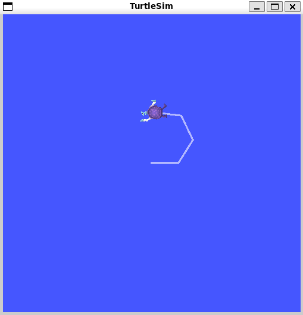
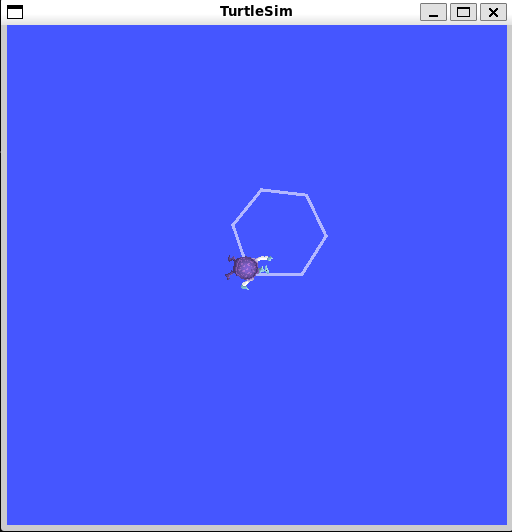

## Turtle Hexagon Path Follower  

## Overview 
The Turtle Hexagon Path Follower is a ROS2 project built using the `turtlesim` simulator.   
This makes the turtle draw a **hexagon shape repeatedly** until stopped externally.   

It demonstrates how to: 
- Publish velocity commands to a simulator 
- Use loops and geometry to create complex motion 
- Automate robot path-following in ROS2 

This is the third project in the Level-1 Practices Repository. 

---

## Package Structure 

turtle_hexagon/ 
│── package.xml # Package metadata (name, version, dependencies) 
│── setup.py # Installation and entry points 
│── resource/ # Resource index 
│── turtle_hexagon/ # Python source code (nodes) 
│── launch/ # (Optional) launch files 

---

## Requirements 
Before running this project, ensure you have: 
- ROS2 Humble (or later) installed   
- A working ROS2 workspace (`ros2_ws`)   
- `turtlesim` package installed:   

  sudo apt install ros-humble-turtlesim 

How to Run 
1️⃣ Navigate to your workspace 
  cd ~/ros2_ws 
2️⃣ Build the package 
  colcon build --packages-select turtle_hexagon 
3️⃣ Source the workspace 
  source install/setup.bash 
4️⃣ Start turtlesim node (in a new terminal) 
  ros2 run turtlesim turtlesim_node 
5️⃣ Run the hexagon controller 
  ros2 run turtle_hexagon turtle_hexagon_node 

What I Learned 

-How to use publisher nodes in ROS2 
-How to control a robot’s motion with linear and angular velocities 
-Using loops and geometry to generate paths 
-Running multiple nodes (turtlesim_node + custom node) together 
-Automation of robot movement 

Demo:

